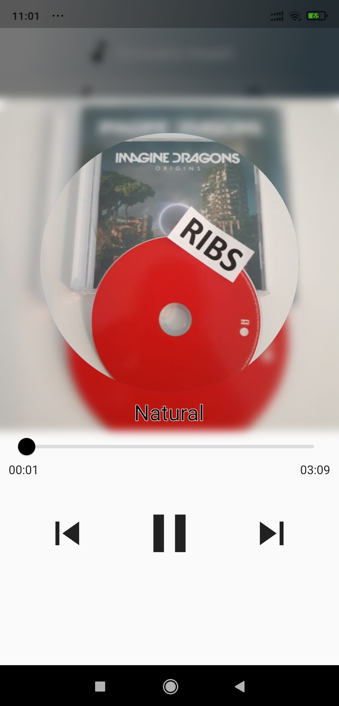

# Flutter
Repository For Flutter Projects  
<ul>
<li> <h1> Music Player Application</h1> 
  
 
    <ul>
    <li>Fully functional music player application using MVVM Architecture</li>
      <li>Query all device audio(music) files</li>
      <li>Order music files based on Song/Album  </li>
      <li>Technologies : </li>
          <ul>
<li> Flutter audio query : to list all local audio files </li>
<li> provider: for state management advancing song slider , current song duration and max duration </li>
<li> Get_it : for dependency injection</li>
<li> Sleek circular slider : for modern graphics</li>
      </ul> 
      
      
    
   
 

  
    
    
   
   
   
  

  
  </li>
  <li> <h1>Shop App </h1>
  
Fully functional multy-user shop app, supported By FireBase RealTime DataBase.
    <ul>
      <li>User-based user authentication</li>
      <li>Each user can upload and edit their own products </li>
      <li> Users can order , edit cart and orders </li>
    </ul> 
    Technologies :
    <ul>
    <li> Provider state management  </li>
    <li> cached network image for minimizing data traffic </li>
    <li> shared preferences</li>
    <li> http requests to firebase backend api</li>
       </ul>
     
     
   
   
   
   
  

  
  
  </li>
  
  
</ul>

